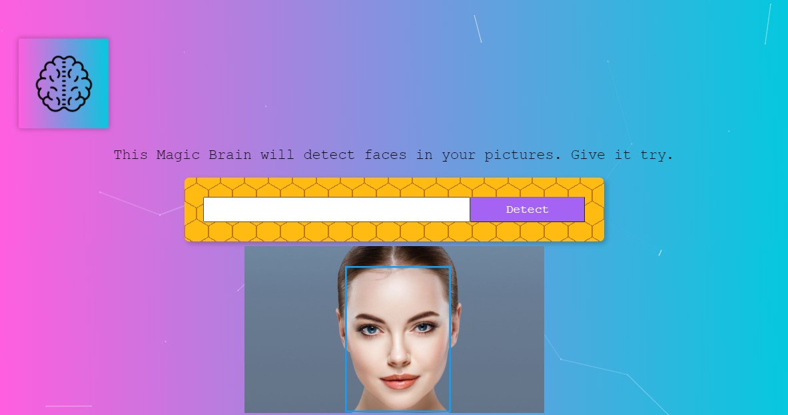

Face Recognition Brain
=================

Face Recognition Brain will detect a human face from an image that you pass as URL and it will mark the face.

[Live Demo](https://eldarcelik.github.io/face-recognition-brain/)

### Getting Started

1. Download/clone repository
2. Run in terminal to install dependencies: npm install
3. Run in terminal to start server locally: npm start
4. Open [http://localhost:3000](http://localhost:3000) to view it in the browser
